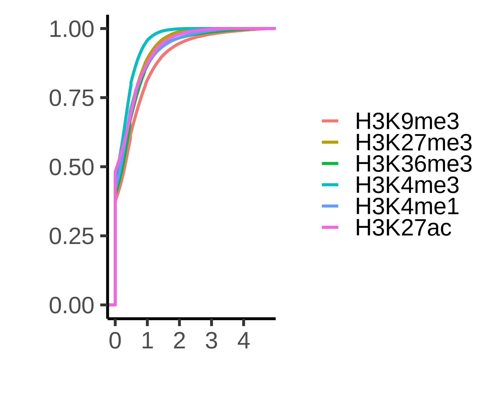
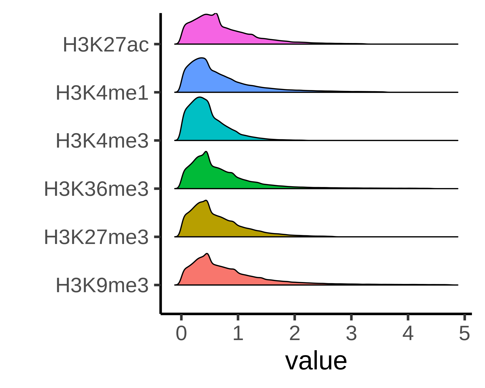
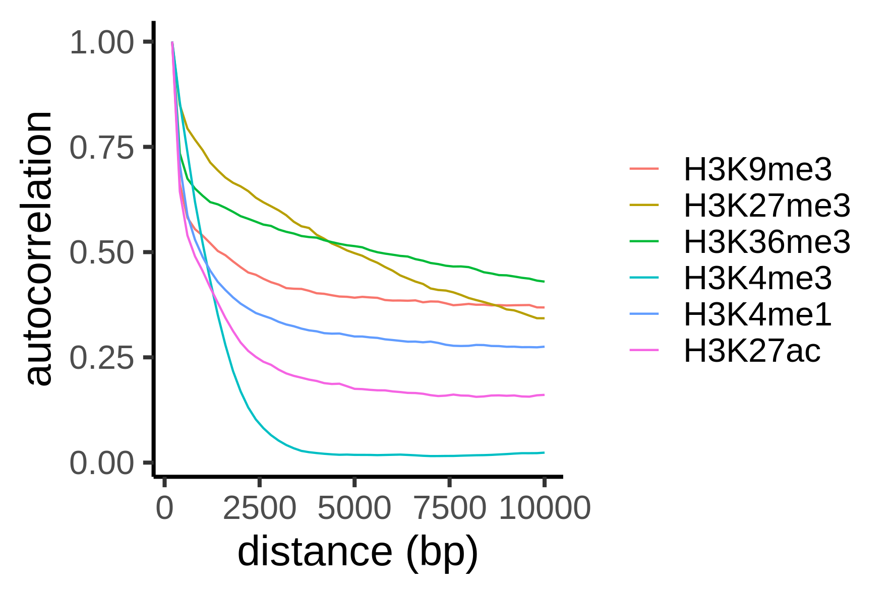
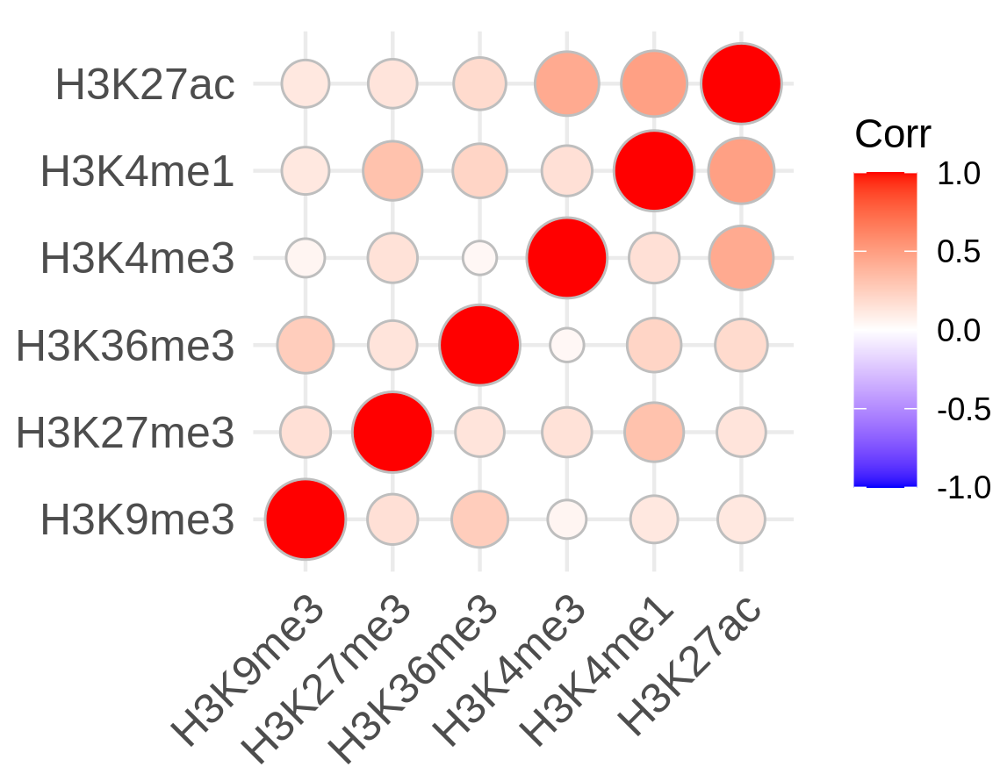
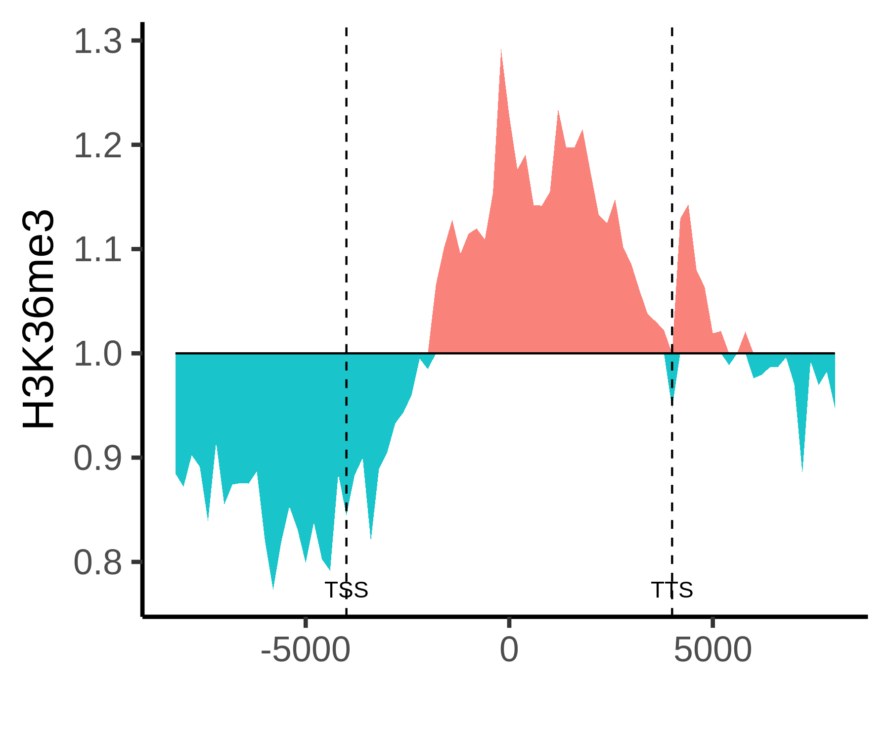
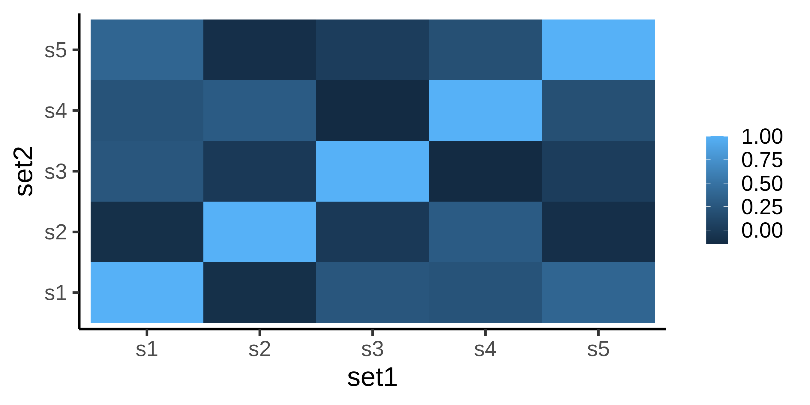
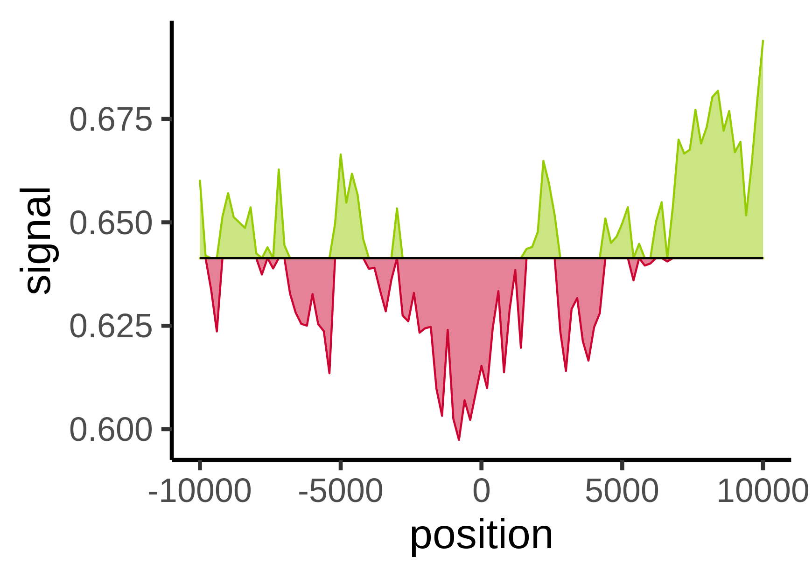
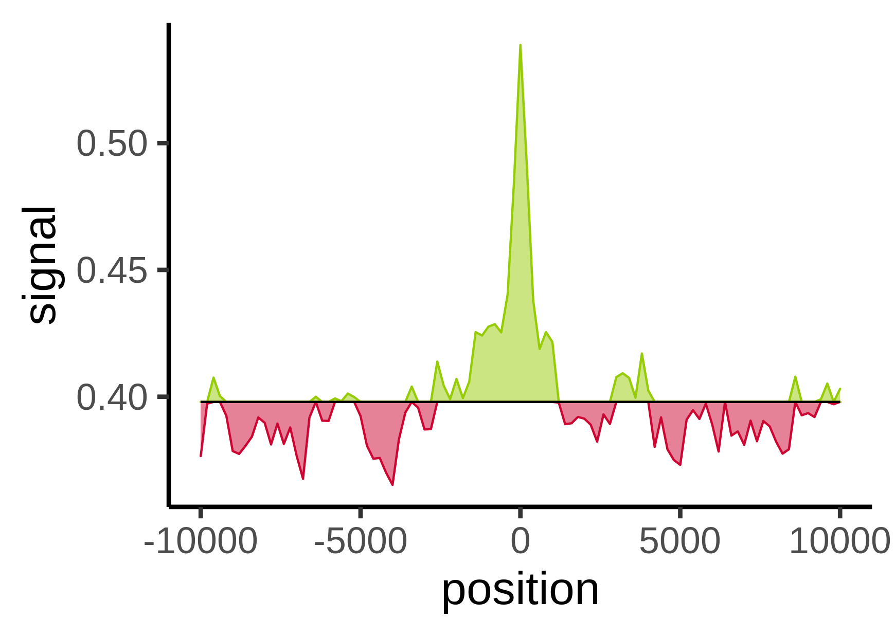

<!-- README.md is generated from README.Rmd. Please edit that file -->

# sigtools

<!-- badges: start -->

<!-- badges: end -->

Sigtools is an R-based visualization package, designed to enable the
users with limited programming experience to produce statistical plots
of continuous genomic data. It consists of several statistical
visualizations that provide insights regarding the behavior of a group
of signals in large regions – such as a chromosome or the whole genome –
as well as visualizing them around a specific point or short
region.

## Third-Party Requirement

[bwtool](https://github.com/CRG-Barcelona/bwtool/wiki)

[bedGraphToBigWig](https://hgdownload.cse.ucsc.edu/admin/exe/linux.x86_64.v369/)

## Installation

You can install the released version of sigtools from
[CRAN](https://CRAN.R-project.org) with:

``` r
install.packages("sigtools")
```

And the development version from [GitHub](https://github.com/) with:

``` r
# install.packages("devtools")
devtools::install_github("shohre73/sigtools")
```

## Input

Genomic signals are genomic coordinates associated with coverage
measurements, probabilities, or scores. *multi-column bedGraph* is the
primary input format for the Sigtools visual
    tasks.

    #>         chr    start      end H3K4me1 H3K4me3   H3K9me3  H3K27ac  H3K27me3
    #> 53846 chr21 10769000 10769200       0  0.0000 0.7089270 0.000000 0.0000000
    #> 53847 chr21 10769200 10769400       0  0.0000 0.0334369 0.147998 0.1679040
    #> 53848 chr21 10769400 10769600       0  0.0000 0.5602450 0.655519 0.0387464
    #> 53849 chr21 10769600 10769800       0  0.0000 0.0000000 0.000000 0.0000000
    #> 53850 chr21 10769800 10770000       0  0.1601 0.5736020 0.000000 0.0970146
    #>        H3K36me3
    #> 53846 0.3371940
    #> 53847 0.0000000
    #> 53848 0.0159367
    #> 53849 0.1509530
    #> 53850 0.0762994

Users can convert several bedGraph files to a multi-column bedGraph file
at the desired resolution by sing Sigtools `toMCbedGraph`.

## Example

Here are some examples of Sigtools application:

``` r
library(sigtools)
```

### Distribution

SigTools generates several distribution plots such as Kernel Density
Distribution and Empirical Cumulative Distribution. These plots assist
in estimating data’s primary characteristics; namely the existence of
multiple local maxima, the overall range, outliers.

Options for distribution plots are `nozero`, `enrichment` and
`percentile`.

``` r
distribution("./test_data/E003-assays_chr21_bin200_bwtool.mcBedGraph", 
             outdir = "distribution", 
             plots = c("ecdf"), 
             header = TRUE, 
             percentile = 99, 
             enrichment = FALSE, 
             nozero = FALSE, 
             x_label = "", 
             y_label = "")

distribution("./test_data/E003-assays_chr21_bin200_bwtool.mcBedGraph", 
             outdir = "distribution", 
             plots = c("curve"), 
             header = TRUE, 
             percentile = 99, 
             enrichment = FALSE, 
             nozero = TRUE, 
             x_label = "", 
             y_label = "")
```



### Autocorrelation

The autocorrelation plot displays the dependency of consecutive bins for
each signal by recurrently calculating the correlation of a signal and
itself when shifted.

``` r
autocorrelation("test_data/E003-assays_chr21_bin200_bwtool.mcBedGraph", 
                outdir = "autocorrelation", 
                header = TRUE, 
                resolution = 200L, 
                lag = 50L)
```



### Correlation

The `correlation` gives you a heatmap of Pearson correlation for 2 sets
of signals. For better comprehension, the association of variables is
encoded in both color and
area.

``` r
correlation(path_mulColBedG_1 = "test_data/E003-assays_chr21_bin200_bwtool.mcBedGraph", 
            header_1 = TRUE, 
            path_mulColBedG_2 = "test_data/E003-assays_chr21_bin200_bwtool.mcBedGraph", 
            header_2 = TRUE, 
            outdir = "correlation", 
            sep = '\t', 
            img_width = 10, 
            img_height = 10, 
            fontSize = 20)
```



### Aggregation

The aggregation plot analyzes the behavior of a signal upon every
occurrence of a specific element. Here, the enriched values of H3K36me3
are depicted over gene bodies of the human 21st
chromosome.

``` r
aggregation(path_mulColBedG = "./test_data/E003-assays_chr21_bin200_bwtool.mcBedGraph",
            path_reg = "./test_data/Ensembl_chr21.gene_info",
            chr = 21,
            mode = "stretches",
            header = TRUE,
            sep = '\t',
            outdir = "aggregation",
            resolution = 200L,
            neighborhood = 20L,
            enrichment = TRUE)
```



<!--




### Aggregation

```r
aggregation("./preprocessing/uniOn.mulColBedg", 5, "./data/enhancer.bed", 'chr21')
```




-->
